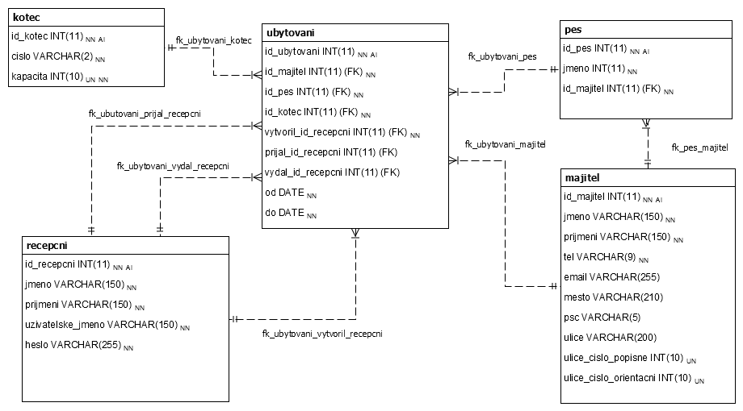

# Vzorová maturitní práce z předmětů PV + DS
Autor: Ing. Jana Spilková, Mgr. Alena Reichlová, Ing. Ondřej Mandík

## Databáze
Pred spustenim systemu je treba vytvorit databazi a naimportovat do ni strukturu, kterou naleznete v SQL skriptu /sql/struktura.sql. 

### Data od zadavatele
Veškerá data dle zadání naleznete ve složce `data`. Tato data, lze importovat do databáze spuštěním SQL skriptu `/sql/data.sql`. 

### E-R model
E-R model databaze v notaci UML naleznete na obrazku . Schéma databáze se nachází v 3. normální formě (3NF).

### Entitní integrita
Je zajištěna pomocí uměle přidaných primárních klíčů, které jsou v každé tabulce označeny jako `id_<nazev_tabulky>` a obsahují automaticky generovaná celá čísla počínaje číslem 1.

### Doménová integrita
TODO
Doménová integrita je zajištěna v aplikaci??

Zajišťuje se pro všecny \textbf{neklíčové atributy}.
	\item V dokumentaci se uvádí \textbf{jakým způsobem} je u každého atributu zajištěna.

	\item Nejsou to pouze datové typy.
\item Není to pouze \texttt{NULL} a \texttt{NOT NULL}.
	\item Pokud je část doménové integrity čitelná z E-R modelu, můžete na něj odkázat.
	\item Neuvádějte zbytečně definice.

\begin{tabular}{|l|l|l|p{70pt}|}
\hline
\footnotesize\sf\bf Tabulka.Atribut   & \footnotesize\sf\bf Datový typ  & \footnotesize\sf\bf IS NULL & \footnotesize\sf\bf Omezení                                          \\
\hline
ZBOZI.CENA        & DOUBLE      & NO   & ZBOZI.CENA\textgreater0                        \\
\hline
ZAKAZNIK.TELEFON  & VARCHAR(11) & YES  & XXX XXX XXX                             \\
\hline
ZAKAZNIK.PRIJMENI & VARCHAR(45) & NO   & \footnotesize\sf Pouze alfabetické znaky v rozmezí 2 až 45 znaků. \\
\hline
...&...& ...   & ...\\

\end{tabular}

### Referenční integrita
Je zajištěna dle následujícího seznamu všech vazeb:

* **ubytovani -- kotec** 
	* Povinná vazba, každé ubytování musí mít kotec. 
	* Kotec nelze smazat, pokud je něj navázáno ubytování, ani změnit ID.
	* Změní-li se službe ID, změna se kaskádově propíše i do tabulky ubytování.

* **ubytovani -- sluzba**
	* Povinná vazba, každé ubytování musí mít službu. 
	* Služba nelze smazat, pokud je na ni vazba z ubytování.
	* Změní-li se službe ID, změna se kaskádově propíše i do tabulky ubytování.

### Pristupove udaje do DB

Server|`193.85.203.188`
Port | `3306`
User | `vmp`
Password | `test`
Database | `vzorova_maturitni_prace`

## Zdrojový kód
Zdrový kód naleznete ve složce `/src`

### Unit testy
Veškeré testy aplikace jsou vytvořeny pomocí frameworku Junit. Třídy, které reprezentují testy jsou v v package nazvaném test. 

Pro spuštění testů v prostředí eclipse je potřeba přidat knihovny Junit 4 pomocí následujícího postupu: *Klikněte pravým tlačítkem na projekt > Properties > Java Build Path > Libraries > Add library* a zvolte *Junit 4*. Následně můžete testy spouštět pomocí okna JUnit v eclipse.